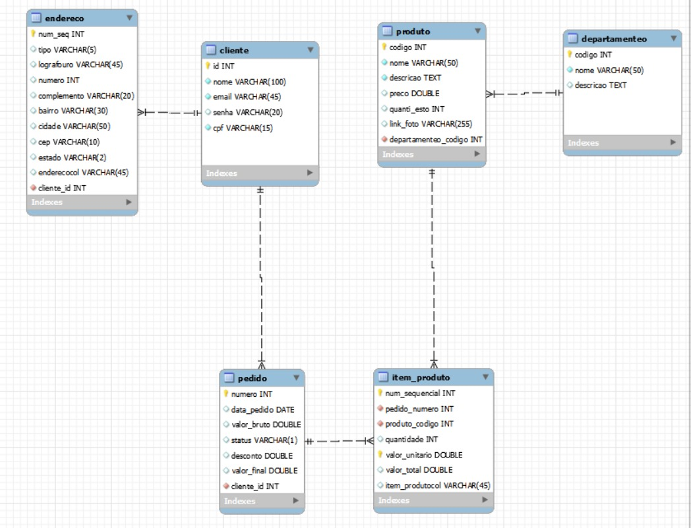

# BANCO DE DADOS 

## Semana 10 - Hacker - Banco de Dados / MySQL

- [x] Por que BD e curiosidades
- [x] Modelo de Trabalho
- [x] Sistema Gerenciador de BD
- [x] Modelo ER</li>
- [x] Estudo de Caso Ecommerce - Modelo ER
- [x] Modelo Relacional
- [x] Transformando Modelos
- [x] Estudo de Caso Ecommerce - Modelo Relacional
- [x] Instalando o MySQL
- [x] Criando base de dados e as tabelas com SQL


		
  		mysql -h localhost -u root -p
		Enter password: *******
  		SHOW DATABASES; => mostra todos os bancos de dados
        
## Mysql: criando um banco de dados e acessando
       	
		CREATE DATABASE ecomerce; 
		USE ecomerce;
		SHOW TABLES; => mostras todas as tabelas
           
                
		CREATE TABLE usuarios(
		nome VARCHAR(50),
		email VARCHAR(100),
		idade INT
		);
		
		DESCRIBE nome_da_tabela; => mostra as descrições da tabela

- [x] Criando as tabelas agora no workbench
- [x] Alterando estruturas e removendo tabelas

- [x] Adiciona a coluna rg apos a coluna senha, alter table cliente add column
           
	    	rg varchar(10) not null after senha;
   
       
- [x] Apaga toda a base de dados

				drop database nome_da_base;
        	


- [x] Altera um coluna

				alter table cliente modify column rg varchar(15);
- [x] Altera o nome da coluna
      
		        	alter table cliente change column rg registro_geral varchar(10) not null;
   

- [x] Mostra os  valores das tabelas

				select * from departameto;

- [x] Inserindo dados nas tabelas

        insert into departameto(numero, nome, descircao) values (1, 'Tecnologia', 'Produtos para computador');
      
ou
      
   	insert into departameto values (null, 'Eletronicos', 'Tudo o que não é computador mais liga na tomada')

ou

        insert into departameto values (null, "Gamas", "Para jogadores Hard Level"), (null, "Acessorios", "Cabos e conectores"), (null, "Alimentação", "Pizza");

 

- [x] Fazendo alterações e compreendendo resultados
   - Atualizando dados


 			update departameto set nome="Informatica e Tecnologia" where numero=1;


- [x] Apagando dados
      
		delete from produto where codigo=1;

		delete from departameto where numero=1;


- [x] Consultas Simples
      
    - Colocando em ordem alfabetica
      
    		select * from cliente orderr by nome asc;
      
    - Buscando por criterio
      
     		select * from cliente where id=1;
      
    - Vendo quantos cadastros existem 
    
    		select count() from cliente;
      
    - Fazendo uma pesquisa
      
	     	select * from produto where nome like "%USB%";


- [x] Agrupamentos e totalizações
      
    - Recuperando quantos produtos há em cada departamento


			select departamento_codigo, count(codigo) from produto group by departamento_codigo

  
- [x] Junções com 2 tabelas
    - Junção simples comomo produto cartesiano
   
   			select * from produto inner join departamento on produto.departamento_codigo = departamento.codigo;

- [x] Junções com 3 ou mais tabelas
    - Passo 1: a partir dos pedidos, faça a junção com os itens de pedido
    - Passo 2: fazer a jumção com o pruduto
    - Passo 3: fazer a junção com cliente 
    
    ```
    	select * from
        pedido inner join item_pedido
            on pedido.numero = item_pedido.pedido_numero
        inner join produto on produto.codigo = item_pedido.produto_codigo
        inner join cliente on pedido.cliente_id = cliente.id;

    ```

- [x] Junções externas
   - Usando

			select * from departamento left outer join produto on departamento.codigo = produto.departamento_codigo;

- [x] Subconsultas
    - Buscando todos os pedidos que possuem o produto mais caro neles
      	- Como saber qual o produto mais caro?


				select * from produto order by preco desc limit 1;
				select * from produto having max(preco);
				select * from produto where preco=(select max(preco) from produto);


	-Pegando os pedidos que contem este produto

    		select * from pedido inner join item_pedido on item_pedido.pedido_numero = pedido.numero where item_pedido.produto_codigo = (select codigo from produto having max(preco));

