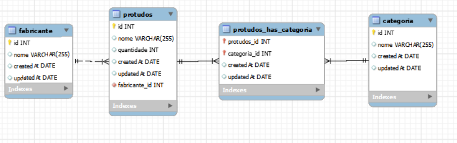

# Semana 12 -- Express

<h2>Aulas</h2>

# Modelo do banco de dados usado

<ol>
<li>[x] Introdução a Express</li>
<li>[x] MVC

    <h4>É uma espece de camadas, são basicamente 3 camadas, model, view e controller.<h3>

    1 - model: é responsavel pela logica do nosso sistema 
    2 - view: é responsavel por descidir como será montada a visualização do usuario
    3 -  Controller: recebe as solicitações dos usuarios

 

</li>
<li>[x] Método HTTP

<ol>
    <h5>Principais Métodos</h5>
    <li>GER - Solicita algum recurso</li>
    <li>POST - Envia alum recurso</li>
    <li>PUT - Atualiza algum recurso</li>
    <li>DELETE - Delta algum recurso</li>
</ol>

</li>
<li>[x] Rotas (Parte 1)</li>
<li>[x] Rotas (Parte 2)</li>
<li>[x] Controller</li>
<li>[x] Nodemoon</li>
<li>[x] ORM - Sequelize (Parte 1)
ORM - A ideia dele é ajudar em todas as operações com o banco de dados usando apenas o JS.
</li>
<li>[x] ORM - Sequelize (Parte 2)</li>
<li>[x] CRUD - Sequelize (Parte 1)</li>
<li>[x] CRUD - Sequelize (Parte 2)</li>
<li>[x] Relacionamentos com Sequelize</li>
<li>[ ] Relações N pra N</li>

</ol>
