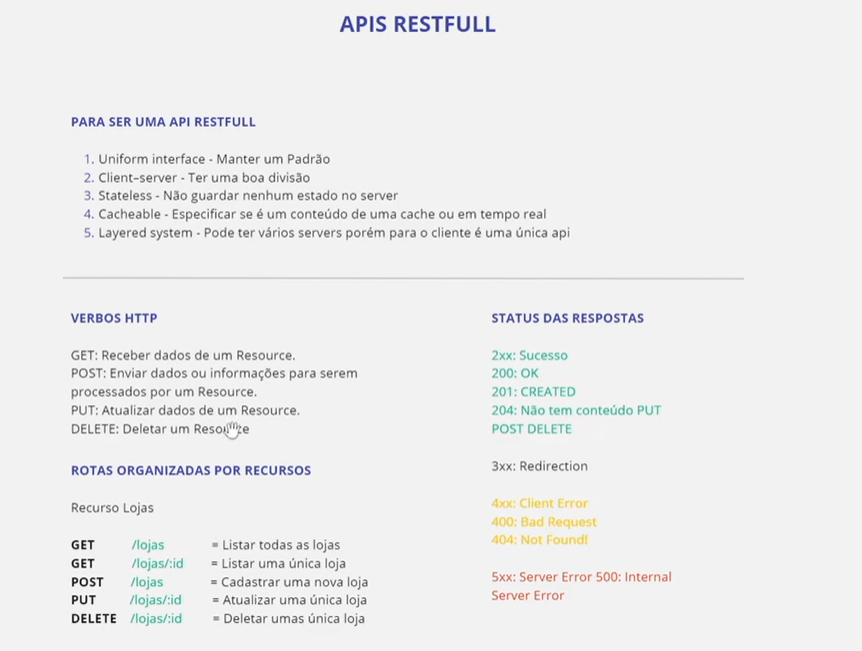

# Semana 13 -- Express II

<h2>Aulas</h2>

<ol>
<li>
[ ] REST API

</li>
<li>[ ] Middlewares</li>
<li>[ ] Autenticação com JWT (parte 1)</li>
<li>[ ] Autenticação com JWT (parte 2)</li>
<li>[ ] Validação de Dados (parte 1)</li>
<li>[ ] Validação de Dados (parte 2)</li>
<li>[ ] Documentação de API</li>

</ol>
