# Semana 14 - Buffer e Streams

<ol>
<li>[x] Introdução Buffer e Streams

</li>
<li>[x] O que são Buffer e Streams
<ol>
<li>Streams 
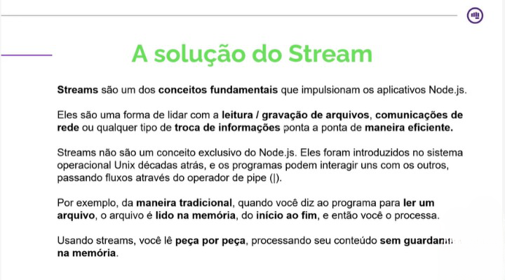

Ou seja, você vai fazer um carregamento por partes, você pode pegar 100 mega coloca na memoria e depois carrega masi 100 mega no lugar dos 100 primeiros.

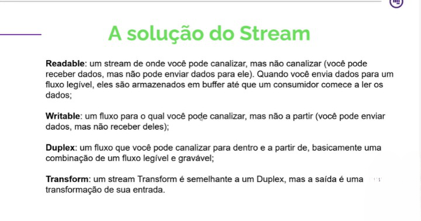
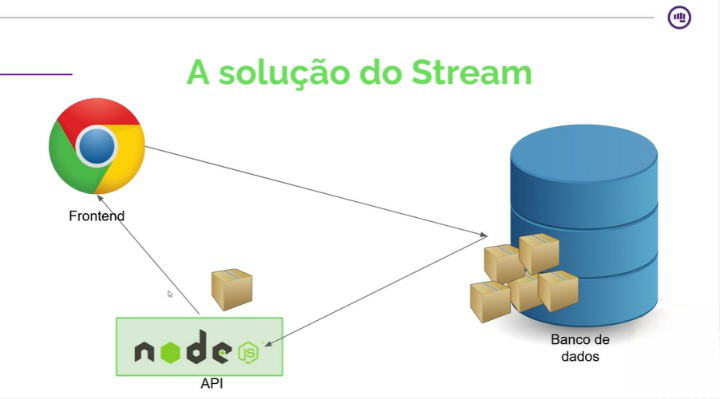
</li>
<li>Buffer 
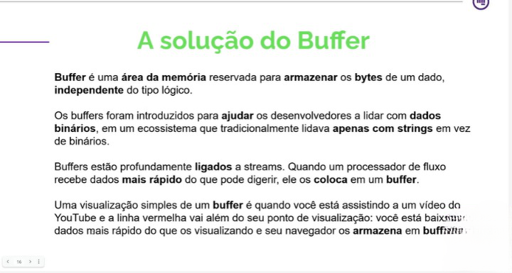
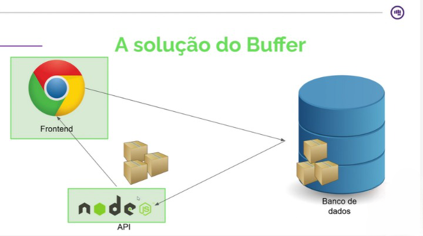

Ou seja o buffer buscar algumas partes e vai consumindo aos poucos, assim que for sendo consumido ele buscar outra parte para colocar na fila.

<im>

</li>
</ol>
</li>
<li>[x] Processamento de dados
<ol>
<li>O que processamento de Dodos 
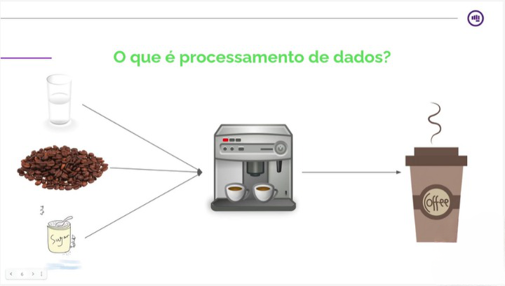
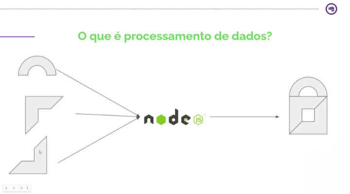

</li>
<li>Qual o problema? 
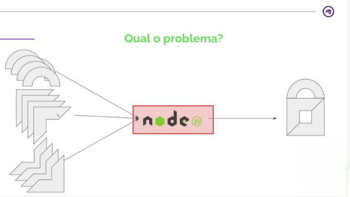</li>
<li>Como o Streams pode ajudar? 
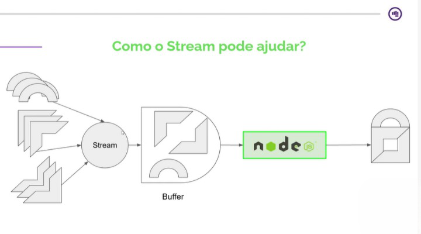
</li>
<li>Arquitetura 
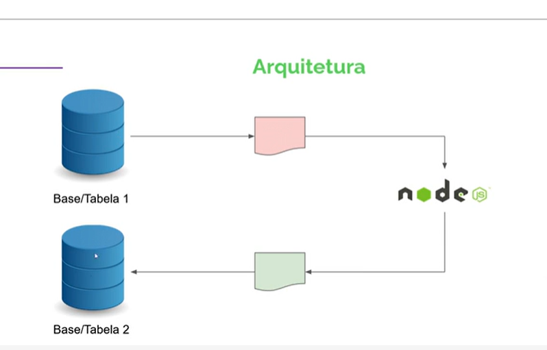
</li>
<ol>

</li>
<li>[x] Prática de processamento de dados - Parte 1 
<li>
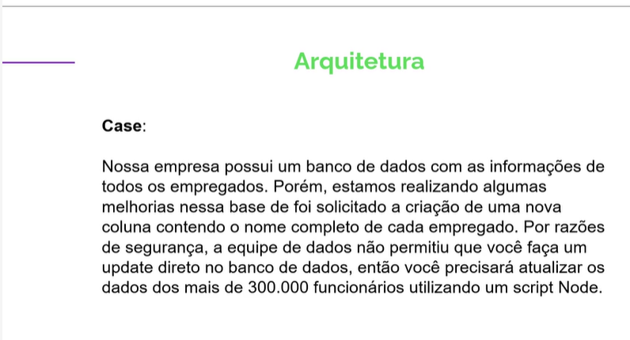
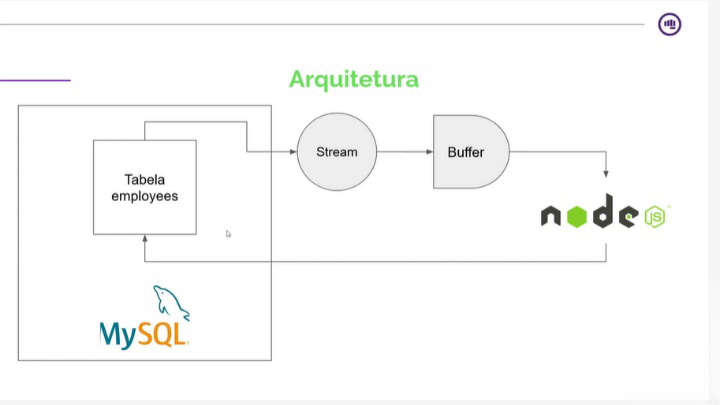

</li>
</li>
<li>[x] Prática de processamento de dados - Parte 2</li>
<li>[x] Prática de processamento de dados - Parte 3</li>
<li>[x] Gerenciamento de arquivos 
<ol>
<h5>O que é gerenciamnto de arquivos</h5>
<li>Cria</li>
<li>Ler</li>
<li>Atualizar</li>
<li>Remover</li>
</ol>
<h5>Arquitedura</h5>
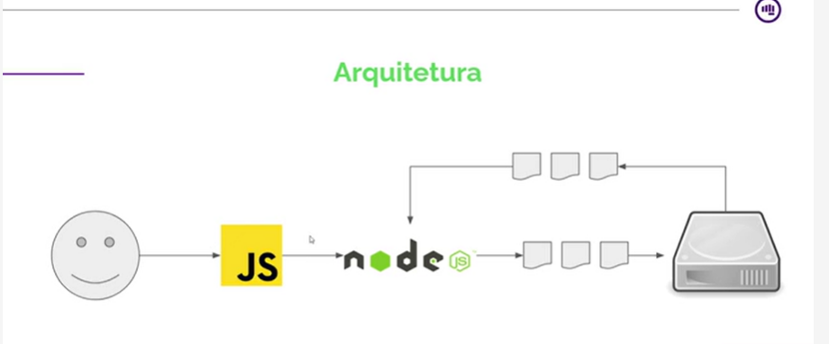
</li>
<li>[x] Prática de gerenciamento de arquivos 
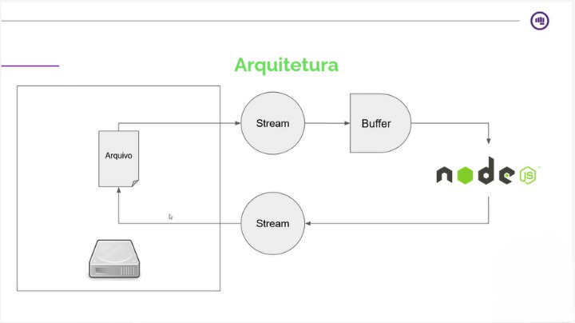</li>
<li>[x] Upload de arquivos 
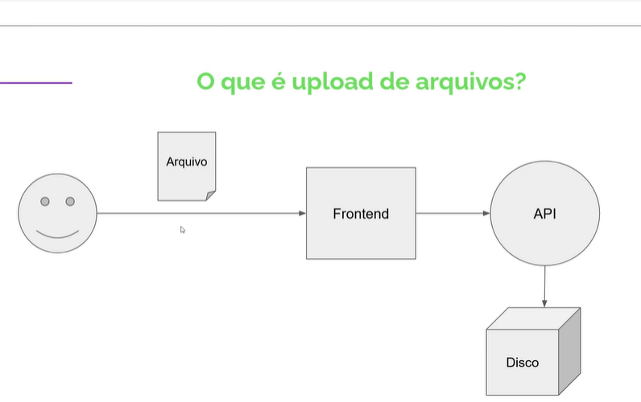
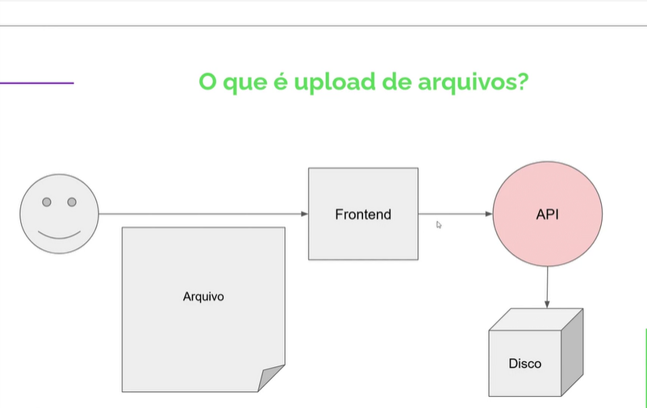 

Acaba lotando a api, pode cair o sistema

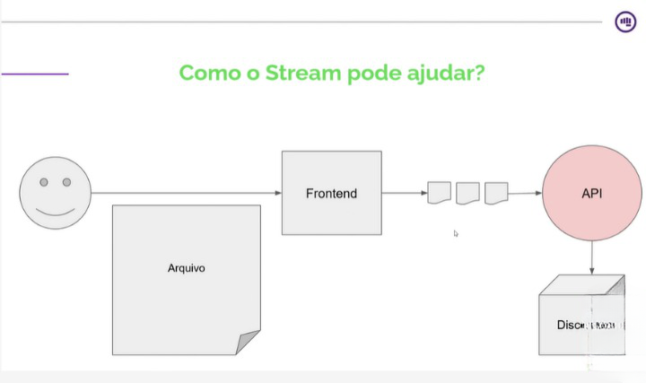
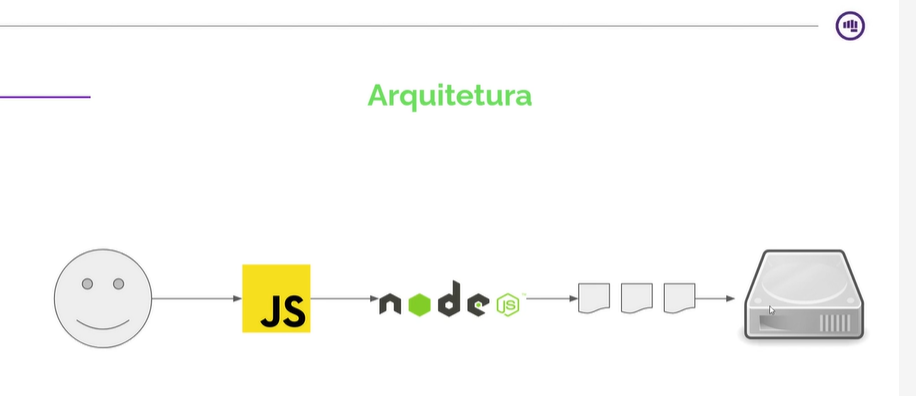
</li>
<li>[ ] Prática de upload de arquivos - Parte 1 </li>
<li>[ ] Prática de upload de arquivos - Parte 2</li>
<li>[ ] Prática de upload de arquivos - Parte 3</li>
</ol>
