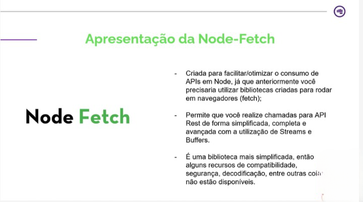

# Semana 14 - Hacker - Consumo de API terceiras

<ol>
<h4>Assuntos</h4>
<li>[x] Introdução Consumo de API terceiras</li>
<li>[x] A importância da integração com terceiros</li>
<li>[x] Como se preparar para integrar</li>
<li>[x] O que é o Node-Fetch? 
<ol>
<li>
<h5>O que é uma biblioteca de integração?</h5>

É um componente do backEnd, mas pode ser intregado no front. 

É um paconte/biblioteca que nos auxilia na hora de se cominicar com APIs externas ao nosso projeto, trazer a base necessária para realizar requisiçães prontas e permitindo que nos concentremos mais nas regras de negócio.

</li>
<li>

 

<a href="https://www.npmjs.com/package/node-fetch">Documentação do node-fetch</a>

</li>
</ol>
</li>
<li>[x] Prática de integração com Node-Fetch - Parte 1
<h5>Premissas</h5>

Não vamos utilizar nenhuma SDK pronto para integração com a Cielo por questões didáticas, mas sempre que for fazer uma integração, sugiro analisar os SDKs disponiveis;

        yarn add express-generator
        yarn start
        yarn add cookie-parser
        yarn add morgan

</li>
<li>[x] Prática de integração com Node-Fetch - Parte 2

<a href="https://developercielo.github.io/manual/cielo-ecommerce#sobre-o-sandbox">Cielo api doc</a>

O node-fetchda v3 é um módulo somente do ESM - você não pode importá-lo com arquivos require().

     yarn add node-fetch

Se você não puder mudar para o ESM, use a v2 que permanece compatível com CommonJS. Correções de bugs críticos continuarão a ser publicadas para a v2.

        yarn add node-fetch@2
        yarn add @types/node-fetch

</li>
<li>[ ] Prática de integração com Node-Fetch - Parte 3</li>
<li>[ ] Prática de integração com Node-Fetch - Parte 4</li>
<li>[ ] O que é o Axios</li>
<li>[ ] Prática de integração com Axios - Parte 1</li>
<li>[ ] Prática de integração com Axios - Parte 2</li>
<li>[ ] Prática de integração com Axios - Parte 3</li>
<li>[ ] Finalização</li>

</ol>
