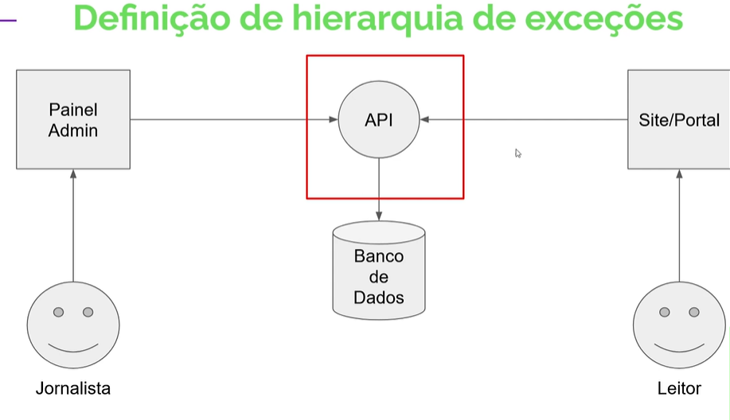
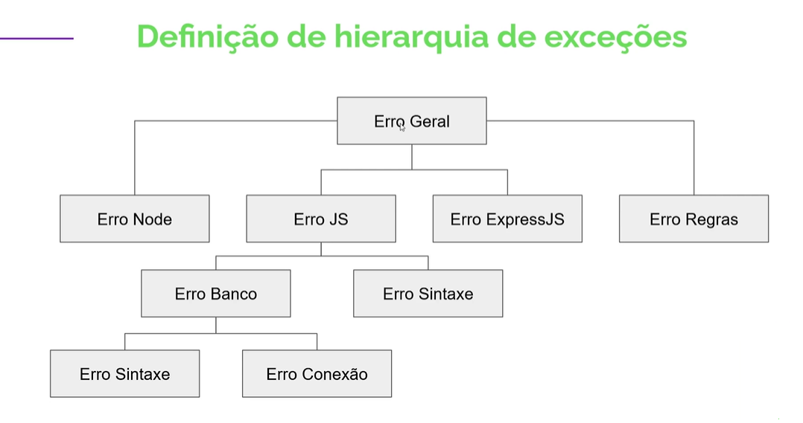
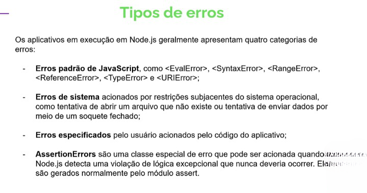
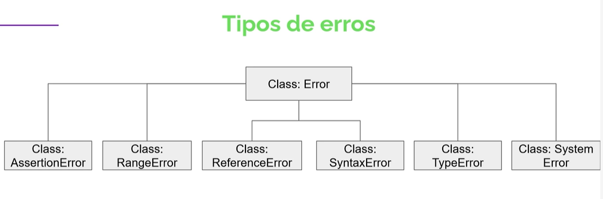
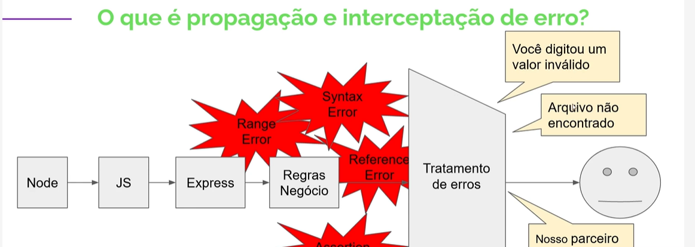
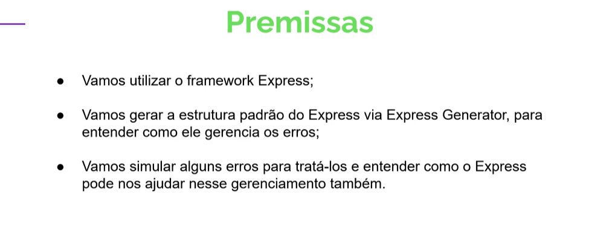
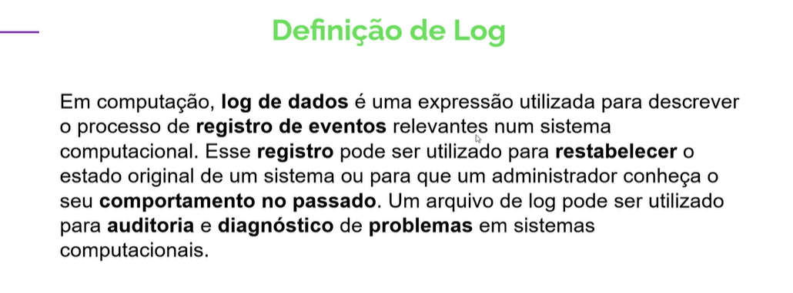
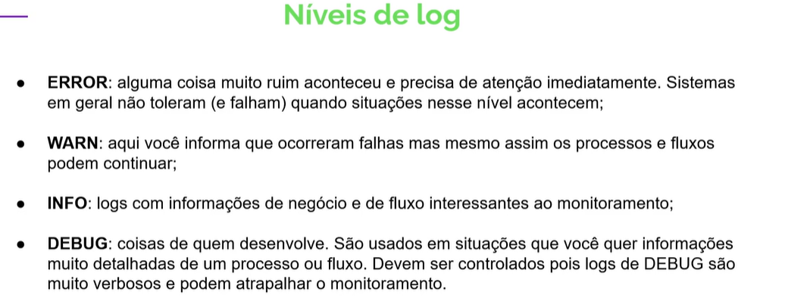

# Hacker - Gerenciamento de erros

<ul>
<li>[x] Introdução Gerenciamento de erros</li>
<li>[x] Gerenciamento de erros: O que é, por que e quando

</li>
<li>[x] Hierarquia de exceções

</li>
<li>[x] Categorias de erros

AssertionErro: Nunca deveria acontecer, mas acontece. É um erro que aconteceu no nucleo da aplicação.

RangeErro: Posição solicitadanão existe no conjunto de dados:  Exemplo.:

        require('net).connect(-1);

ReferenceErro: Tentativa de acerssar variável que não existe.

SyntaxErro: Código escrito errado.

TypeErro: Tipo de argumento enviado é inválido.

        require('url').parse(()=>{});

SystemErro: Acontece em tempo de execução, quando ocorrw algum erro na comunicação entre aplicação e sistema operacional.  Exemplo: tentar ler um arquivo não existente.

</li>
<li>[x] Propagação e interceptação</li>

<li>[ ] Demonstração de tratamento de erros - Parte 1</li>

<h4>Gerando api com os padrões do express</h4>

                npx express-generator
                yarn add -g express-generator
                express

<li>[x] Demonstração de tratamento de erros - Parte 2</li>
<li>[x] Log de erros</li>

<li>[ ] Demonstração de log</li>

                yarn add winston

</ul>