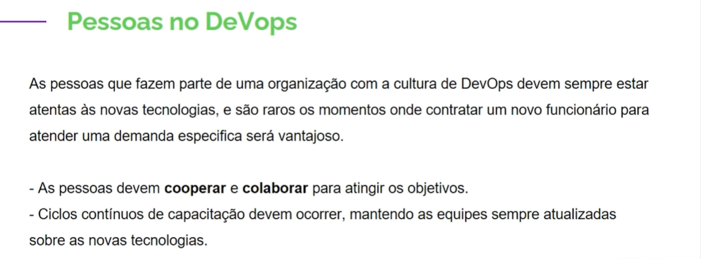

# Semana 16 - Hacker - Cultura DevOps

<ol>
    <li>[x] O que é Devops?
        

        

        

    </li>
    <li>[x] Porque devo adotar a cultura Devops
        

        

        

        

    </li>
    <li>[x] História do Devops
        

        

        

        

    </li>
    <li>[x] Conceito do Devops
        

    </li>
    <li>[x] CAMS
        

        

        

        

        

        

        

    </li>
    <li>[x] PPT - pessoas, projetos e tecnologias
        

        

        

        

        

        

        

        

        

        

    </li>
    <li>[x] Devops Ágil
        

        

    </li>
    <li>[ ] CI/CD
        

        

        

        

        

        

        

    </li>
</ol>